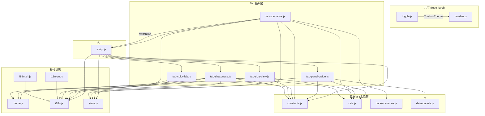

# monitor-choice — 架构分析

> 分析日期: 2026-07-09 · 纯分析，未改代码

## 加载顺序与全局依赖

`index.html` 中 17 个 `<script>` 按顺序加载，后加载者依赖前面定义的全局变量：

| # | 文件 | 定义的全局 | 角色 |
|---|------|-----------|------|
| 1 | `toggle.js` | `window.ToolboxTheme` | 共享主题 (repo-level) |
| 2 | `nav-bar.js` | `window.ToolboxNav` | 共享导航栏 (repo-level) |
| 3 | `js/theme.js` | `window.ThemeManager` | Canvas 主题 (init/toggle/getCanvasBg/getCanvasColor/onChange) |
| 4 | `js/i18n.js` | `window.I18n` | i18n 引擎 (t/setLocale/refreshDOM/translations) |
| 5 | `js/i18n-zh.js` | (mutates I18n.translations.zh) | 中文翻译 |
| 6 | `js/i18n-en.js` | (mutates I18n.translations.en) | 英文翻译 |
| 7 | `js/constants.js` | `window.Constants` | 静态参考数据 (分辨率、色域、面板类型) |
| 8 | `js/calc.js` | `window.Calc` | 纯数学函数 (PPI/PPD/FOV/THX/SMPTE) |
| 9 | `js/state.js` | `window.AppState` | 响应式状态 + localStorage |
| 10 | `js/data-scenarios.js` | `window.Scenarios` | 场景数据 |
| 11 | `js/data-panels.js` | `window.PanelGuideData` | 面板百科数据 |
| 12 | `js/tab-sharpness.js` | `window.TabSharpness` | 清晰度实验室 Tab |
| 13 | `js/tab-size-view.js` | `window.TabSizeView` | 尺寸与距离 Tab (含 3D 场景) |
| 14 | `js/tab-color-lab.js` | `window.TabColorLab` | 色彩空间 Tab (CIE 1931) |
| 15 | `js/tab-scenarios.js` | `window.TabScenarios` | 场景推荐 Tab |
| 16 | `js/tab-panel-guide.js` | `window.TabPanelGuide` | 面板百科 Tab |
| 17 | `script.js` | `window.switchTab` | 入口/编排器 |

> ⚠️ 注意: 原 TASKS.md 提到的 `window.PanelRegistry` 和 `window.State` 在此代码库中不存在。实际等价物是 `window.PanelGuideData` 和 `window.AppState`。

## 模块依赖图

## 各文件职责

### 共享层 (repo-level)

- **toggle.js** — Toolbox 主题运行时 (UMD)。暴露 `window.ToolboxTheme`，localStorage key 为 `toolbox-theme`。NavBar 主题按钮调其 `toggleTheme()`。
- **nav-bar.js** — Toolbox 导航栏 (UMD)。自挂载到 `#toolbox-nav`，含品牌下拉、快捷链接、主题按钮、移动端汉堡菜单。根据 `location.pathname` 自动高亮。

### 基础设施

- **theme.js** — Canvas 主题管理器。暴露 `window.ThemeManager` (init/toggle/getStoredTheme/getCanvasBg/getCanvasColor/onChange)。共用 `toolbox-theme` key。提供 `getCanvasBg()`/`getCanvasColor(name)` 供 Canvas 绘制读取 CSS 变量。
- **i18n.js** — i18n 引擎。暴露 `window.I18n` (t/setLocale/getLocale/onChange/init/refreshDOM)。遍历 DOM 中 `data-i18n` 属性自动替换文本。语言持久化到 `localStorage["monitor-choice-lang"]`。
- **i18n-zh.js / i18n-en.js** — 翻译数据，填充 `window.I18n.translations.{zh,en}`。
- **constants.js** — 静态参考数据：分辨率列表、宽高比、CIE 1931 光谱轨迹、面板类型、接口带宽阈值。零 DOM 依赖。
- **calc.js** — 纯数学函数：`computePPI`, `computePPD`, `computeRetinaDistance`, `resolveDimensions`, `computeHorizontalFOV`, `computeTHXDistance`, `computeSMPTERange`, `computeInterfaceBandwidth`, `computeDeskConstraint`。**100% 纯函数，所有 Tab 共用**。
- **state.js** — 响应式状态存储。暴露 `window.AppState` (get/set/batch/onChange/savePreferences/loadPreferences)。6 个持久化 key: `distance`, `size`, `resolution`, `workPercentage`, `mediaPercentage`, `deskDepth`。Pub/sub 模式。

### 数据

- **data-scenarios.js** — 9 个使用场景的参考数据（推荐尺寸/PPI/PPD 范围、文案）。
- **data-panels.js** — 面板技术百科（IPS/VA/TN/OLED/Mini-LED、烧屏、刷新率对比）。

### Tab 控制器

所有 Tab 暴露 `{init(), destroy()}` 模式。`script.js` 在切换 Tab 时调用旧 Tab 的 `destroy()` 和新 Tab 的 `init()`，确保同一时间只有一个 Tab 活跃。

- **tab-sharpness.js** — PPI/PPD 计算 + 清晰度仪表盘 Canvas + 文字对比模拟 Canvas。
- **tab-size-view.js** — 尺寸/FOV/THX/SMPTE 统计 + 2D 对比 Canvas + 伪 3D 桌面场景 Canvas（含拖拽）。
- **tab-color-lab.js** — CIE 1931 色度图 Canvas + 色域三角 + 面板对比表。
- **tab-scenarios.js** — 场景卡片 + 筛选，点击"应用"自动选分辨率并跳转到相关 Tab。
- **tab-panel-guide.js** — 面板技术手风琴 + 接口带宽实时计算器。

### 入口

- **script.js** — 编排器：初始化分辨率选择器、同步输入控件与 AppState、绑定 Tab 导航、保存/清除/语言按钮。实现懒 Tab 生命周期（切换时 destroy → init）。

## 死代码

| 函数/逻辑 | 位置 | 原因 |
|-----------|------|------|
| `Calc.computeTextComfort` + `Calc.clamp` | `calc.js` | 导出但从未被任何 Tab 调用 |
| `scenario.relatedTabs` | `tab-scenarios.js` | 引用此字段但 `data-scenarios.js` 中没有任何场景定义 `relatedTabs` |
| `workPercentage` / `mediaPercentage` | `state.js` → `script.js` | 仅用于滑块 UI 显示，未输入任何计算 |

## 可提取的纯函数 (适合单元测试)

| 来源文件 | 函数 | 说明 |
|----------|------|------|
| `calc.js` | 全部 10 个函数 | 零 DOM、零 I/O，完全可测 |
| `state.js` | `createStore(initial, configKeys)` | 提取工厂函数，mock 存储 |
| `i18n.js` | `translate(t9n, locale, key, params)` | 纯翻译查找 + 插值 |
| `tab-sharpness.js` | `findAltResolution`, `ppdLabel`, `ppdColor` | 纯逻辑 |
| `tab-size-view.js` | `project3d(point, camera)` | 3D→2D 投影 (纯数学) |
| `tab-color-lab.js` | `chromaticityToPx(x, y, box)` | CIE 坐标→像素 |
| `tab-scenarios.js` | `pickResolutionForScenario(scenario, Resolutions, Calc)` | 场景→分辨率匹配 |
| `tab-panel-guide.js` | `classifyInterfaces(bw, thresholds)` | 带宽→接口兼容性 |

## ES Modules 迁移方案

### Phase 1: 最小迁移（Tab 模块化）

**目标**: Tab 文件用 ES modules，基础设施保持全局变量。

- 共享文件 `toggle.js` / `nav-bar.js` 保持经典 `<script>`（跨 app 共享，先不动）
- `constants.js` / `calc.js` / `state.js` / `i18n.js` 保持全局（Tab 依赖它们）
- 5 个 `tab-*.js` + `script.js` 改为 `type="module"`，通过 `import` 引入依赖
- `script.js` 改为 `<script type="module">` 单入口，其余 16 个 `<script>` 移除
- 将 `window.switchTab` 提取为 `tabs.js` 模块，避免 tab-scenarios ↔ script.js 循环引用
- 语言文件 `i18n-zh.js` / `i18n-en.js` 改为 `export const zh/en = {...}`，`i18n.js` import 它们（反转依赖方向）

### Phase 2: 完全模块化

**目标**: 移除所有全局变量。

- 将 `constants.js` / `calc.js` 改为 `export const/function`
- 将 `state.js` 改为 `export const AppState = createStore(...)`
- 将 `i18n.js` 改为 `export function createI18n(translations)`
- `toggle.js` / `nav-bar.js` 升级为 ES modules（需协调整个 Toolbox repo）

### 关键风险

- **模块延迟**: ES modules 是 deferred 的（`DOMContentLoaded` 可能已触发）。检查 `document.readyState` 并在 `init()` 中做出防御性处理。
- **Canvas Tab 生命周期**: `script.js` 调用 `window.TabX.init/destroy` → 改为 `import {TabX}` → 直接调用，无接口变化。
- **测试**: 纯函数提取后可直接用 vitest 测试，Tab 控制器可用 jsdom + vitest 测试 DOM 渲染。

## 总结

| 指标 | 数值 |
|------|------|
| 总 JS 文件 | 17 (含 2 共享) |
| 全局变量 | 14 |
| 纯函数可提测 | ~25 个 |
| 死代码 | 2 个函数 + 1 个分支 |
| 迁移影响文件 | 全部 15 个 app-level JS |
